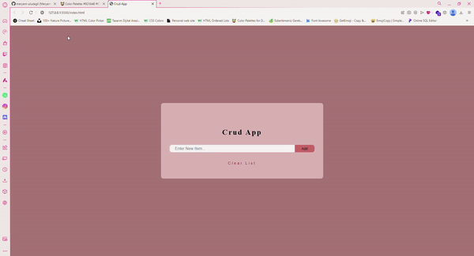

# ✏️Crud-App

A simple CRUD application built with JavaScript, HTML, and CSS. The app allows users to add, edit, delete, and clear items from a list. It demonstrates basic DOM manipulation, form handling, and event-driven JavaScript.

# ⚡ Technologies Used

- HTML: For structuring the app's layout.
- CSS: For styling the UI components.
- JavaScript: For handling CRUD logic, events, and DOM manipulation.

# 🌸How to Use

1. Add Item: Enter text in the input field and press the "Add" button to add it to the list.
2. Edit Item: Click the edit icon next to any item to modify its content, and then submit the updated value.
3. Delete Item: Click the trash icon to remove a specific item from the list.
4. Clear List: Click the "Clear List" button to remove all items from the list.
5. Alerts: Feedback alerts will notify you when an item is added, edited, deleted, or when the list is cleared.

# 👀🤩Preview

